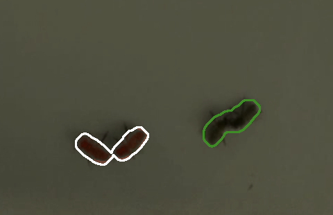

# Honeybee Swarm Dynamics: Investigating the Relationship Between Individual Decision Making and Collective Foraging

# Computer Vision Pipeline
[Project Report](https://jjhickmon.github.io/dreu/files/finalreport.pdf)

If anything is unclear or any other information is needed, please please please contact me, and I am more than happy to help clear up any issues. My school email is javonh@cs.washington.edu, but if this changes, feel free to also use my personal email jj.hickmon@gmail.com

## Note
The code provided was run an a MacBook Pro 2023 with 32 GB memory and the M2 chip. It has not yet been tested on other devices, so some minor modifications may be needed in order to speed up processing times or reduce memory usage.

Some of the requirements listed in requirements.txt may no longer be needed. Feel free to only install necessary libraries.

## Overview:
This repo builds off of the code for the computer vision/deep learning pipeline used to analyze honey bee experimental data in [(Nguyen et al. 2020)](https://www.biorxiv.org/content/10.1101/2020.05.23.112540v1). The pipeline focuses on spatiotemporal consistency when tracking individual bees in videos, classification of bees into scenting bees (wide wing angles as primary proxy for scenting), and estimation of the bees' body orientations.

## Main requirements (versions tested on):
- Python 3.6
- NumPy 1.18.5
- OpenCV 4.1.1.26
- PyTorch 1.3.1
- PyTorch TorchVision 0.4.2
- Matplotlib 3.1.3
- [FFmpeg](https://ffmpeg.org/)

The complete list of required packages (besides FFmpeg) provided in *requirements.txt*, which you can install in your environment with the command `pip install -r requirements.txt`. Setting up a Python virtual environment, such as [conda](https://docs.conda.io/projects/conda/en/latest/user-guide/tasks/manage-environments.html) with `pip`, is highly recommended.


<!-- ----------------------------------------------------------------------- -->

For all of these scripts to work properly, you should keep the honeybee source videos such that the folder structure is as follows:


```
scripts.py
data/
    processed/
        video_name/
            video_name.mp4
```

<!-- ----------------------------------------------------------------------- -->

## Step 0. Clean Video

This script realigns and crops the arena from the video, while denoising the image so there aren't any bars on the image due to lighing/framerate issues. In order to use this file, simply run step_0__clean_video.py.

This will start by setting up helper directories, then converting the video into frames. This step may take a long time depending on the number of frames in your video.
1. Once the scripts finishes processing the frames, you will need to select the top left and top right corner of the arena. This will begin to align the frames, make sure you press 'q' to begin this process.
2. After this, in order to crop the frames, select the top left and bottom right corners of the arena, then press 'q' in order to begin the process.

NOTE: pay attention to how much memory you have available on your device. This script will save the individual frames, which could be costly depending on the length of the video.

NOTE: Future work may include: modifying the scripts to not separate the frames, since the new tracker can simply process an entire video saving a significant amount of memory. Along with this, future iterations of the project should realign frames in batches, so that the processing time decreases. Batching the frame realignment will take up more memory, so scale the batch size with the device being used.

## Step 1. Run tracker

This is a semi-automatic process that uses manual thresholding, morphological transformations, and our custom algorithm to detect individual bees in the frames. Bees that are in clusters (i.e. touching or overlapping with one another) are separated into the individuals that compose the cluster.


### Preprocessing
One of the most important steps for the tracker to work properly, is the preprocessing step. You can toggle whether or not you want to load previously used preprocessing, within the utils/settings.py file. The first time you process a video, LOAD_PREPROCESS_SETTINGS must be toggled to True.

When you enter the preprocessing step, your window should have the title "manual point select - press ENTER to continue". This is signalling you to manually select the bodies of the bees you want to track. You should select all of the worker bees in frame. After selecting the worker bees, press ENTER.

You should now see a screen with 4 views of the arena, with the title reading "modifying settings color_multiplier=7". This window allows you to manually modify the preprocessing settings, and your current setting is the color multiplier with a value of 7. The top left window shows your image immediately after doing color multiplication, the top right is the image with color multiplication and after performing background subtraction, the bottom left is the image with all of the artifacts (as manually defined in utils/settings.py) removed, and the bottom right is the image with an overlay to show the detected bee contours and the artifacts.

In order to get everything set up properly, you must modify the ARTIFACT_LOCATIONS in utils/settings.py in order to remove any portions of the image that you do not want to detect after performing background subtraction, this can be seen by viewing the white spots in the top right, and setting the box locations to be over these areas. The box locations are of the form (x, y, width, height).

After setting the artifact locations, you must modify the other settings so that the bees show up as clearly as possible. This is without a doubt the most important step of the preprocessing, because it dicatates whether or not the bees will later be properly detected. The best way I've found to do this, is to modify each of the following values until you get a state where the bees are detected throughout the entirety of the video, without flickering (i.e. the bees no longer being detected then re-detected). Here are the settings:
    - color_multiplier (shortcut key: 'm'): multiplies all of the pixels in the image by a fixed value. This parameter can reduce the effect of noise, since pixel values are capped at 255, therefore darker values will still be prominent while lighter values will reduce in variance.
    - threshold (shortcut key: 't'): thresholds the grayscale image by the specified value. This removes pixels from consideration during the detection process, based on their darkness/lighness. This setting is very important, but try to keep it as low as possible, because the bees often get darker when they go to the corners (and darker pixels result in lower values).
    - color_thresh (shortcut key: 'c'): thresholds the image based on the colors identified from each of the bees selected in the previous step. This also serves as performing background subtraction for the image, so be careful with modifying this value. Try to strike a good balance between the bees showing up properly, and the background not becoming an artifact.

There are a few other details that go towards preprocessing, which you can view in preprocess() (within preprocess.py) or update_frame() (also in preprocess.py), but the ones listed above are typically the most important. Feel free to play around with all of these values until you find a good balance.

### Tracking
If you effectively defined your preprocessing values, you should be able to see the honeybees being tracked throughout the video. Typically the default settings work well, but if not, you may also need to explore other settings such as MIN_BEE_AREA, MAX_BEE_AREA, MIN_GROUP_AREA, and MAX_GROUP_AREA. These simply define the smallest and largest contours that can be detected as individual bees, and the same for groups. For each of these contours, there are also a few other fields that dictate their validity. MAX_MOVE_DISTANCE defines the maximum distance an individual bee contour can move, before we know that the tracker has made a mistake. Similarly MAX_THRESH_COLOR_DIFF defines the maximum variance in color values, before we know that we have mis-detected a honeybee, this will come into play when I discuss manual thresholding.

Note: there are many ways that this preprocessing step can be improved, which I will discuss in the future work section.

### Manual Segmentation
If the automatic segmentation as described in the [Project Report](https://jjhickmon.github.io/dreu/files/finalreport.pdf) fails,
then the program will revert to manual segmentation. Typically for this step, you will just cick on each of the individuals
in the highlighted area, then press enter. Sometimes this method does not work though, I will go through the scenarios where this
method fails.

- If a bee is no longer detected, then this may become an issue. Bees can sometimes no longer be detected because their labels are reassigned to some artifact, or they are no longer detected in the frame due to the preproessing. The best solution for this is to refine the preprocessing, but the reason why this occurs, is because manual segmentation is activated when the program detects a group is formed. If the bee is no longer detected, then the program will detect that error has been made in the segmentation process, and it will enter manual segmentation mode to fix the bee labels.
- If bees are too close together or overlapping. In this case, then the system will be unable to use the standard method of progressive watershedding/color thresholding, in order to segment the bees. In this case, sometimes even manual segmentation will not work (especially if the bees are overlapping), and this is the main pitfall of the current method.


### Input:
Images of frames extracted from video. Images should be stored in *data/processed/{folder_name}/{frames_folder_name}/*. A small dataset is provided [here](https://drive.google.com/drive/folders/1adOMmJc2hFB4eaDnGkpJkUybTysl3bRh?usp=sharing), and should be unzipped and placed in *data/processed/*. Inside the dataset folder, *denoised_frames/* holds the images from a short video. There is also a folder *UI_annotation_history* that holds sample data for the annotation described below.

### Usage:
**`python step_1__run_tracker.py`** takes in the a video and background image from a chosen data folder and starts running the tracker. The first frame of the video should have no overlapping bees (or the pipeline should be modified to run manual labelling first).

**Steps**
1. Select the root folder for the video to track.
2. Select the video within the root folder to analyze
3. Select the background image which should have been extracted from the video

Files should be structured as follows:
- data/processed/{root_folder_name}/
- data/processed/{root_folder_name}/{video_name}
- data/processed/{root_folder_name}/{background_image_name}

### Output:
After the algorithm detects bees, *data_log.json* will be created and it stores information of all the detected bees: the x, y positions of the bounding box top left corner and the width and height of that box. For visualization, a folder *detection_frames* and movie *{VIDEO_NAME}_contours.mp4.mp4* will be created to show the output detections.

<!-- ----------------------------------------------------------------------- -->

## Step 2. Classify scenting bees

After detections in step 1, the individual bees can then be classified into scenting and non-scenting bees. We trained a ResNet-18 model for this binary classification task, and provide the trained model you can download [here](https://drive.google.com/file/d/11nA6UtDye5NATWTOW54LrWoLcc2kuFRl/view?usp=sharing).

### Input:
The trained model (.pt file) should be placed in *scenting_classification/saved_models*. Input data to be processed should be in *data/processed/{folder_name}*: the *data_log.json* and the frame images (e.g. *denoised_frames*).

### Usage:
**`python step_2__run_scenting_classification.py`** runs the detection data through the model to classify individual bees into scenting or non-scenting. Running on a GPU is highly recommended for speed.

**Command line parameters:**
- `-p` or `--data_root`: Path to the data folder (default: `data/processed`)
- `-m` or `--model_file`: Name of trained model (default: `ResnetScentingModel.pt`)
- `-b` or `--batch_size`: Batch size (default: `32`)
- `-c` or `--num_classes`: Number of classes (default: `2`)

### Output:
In the data folder for this specific movie, *data_log_scenting.json* will be created from this step. This builds upon *data_log.json* and adds a 'classification' to each bee in each frame.

### To retrain model:
Training data should be in *data/training_data/scenting_classifier*. Sample labeled data is provided [here](https://drive.google.com/drive/folders/14bVvOCAwD4TbqOD0GoJ1msMFzvYZIICg?usp=sharing).

Navigate to *scenting_classification* and run **`python train_scenting_classifier.py`**. Trained models will be stored in *saved_models*. At the end of training, evaluation plots (training curves, ROCs, confusion matrices) will be made and stored in *eval_visualization*.

**Command line parameters:**
- `-p` or `--data_root`: Path to the data folder (default: `'../data/training_data/scenting_classifier'`)
- `-l` or `--load_idxs`: Load previous data splitting indices (default: False)
- `-d` or `--dropout`: Apply drop out (default: 0.0)
- `-a` or `--augmentation`: Apply augmentations (default: True)
- `-t` or `--test_split`: Test set split proportion (default: 0.2)
- `-v` or `--val_split`: Validation set split proportion (default: 0.1)
- `-s` or `--shuffle`: Shuffle data sets (default: True)
- `-b` or `--batch_size`: Batch size (default: 32)
- `-c` or `--num_classes`: Number of classes (default: 2)
- `-r` or `--learning_rate`: Learning rate (default: 0.0001)
- `-m` or `--load_model`: Load a model (default: False)
- `-f` or `--load_path`: Path to model to load (default: `saved_models/ResnetScentingModel.pt`)
- `-e` or `--num_epochs`: Number of training epochs (default: 20)
- `-q` or `--save_freq`: Frequency for saving model (default: 10)

<!-- ----------------------------------------------------------------------- -->

## Step 3. Estimate orientations

We can also obtain the body orientation of the scenting bees to know their scenting directions. Another ResNet-18 model is trained for the regression task of estimating the orientation angle (head to tail) of bees. The trained model is provided [here](https://drive.google.com/open?id=11t5OYkj43LwlPKBGpeGw4E4OeKpwfopD).

### Input:
The trained model (.pt file) should be placed in *orientation_estimation/saved_models*. Input data to be processed should be in *data/processed/{folder_name}*: the *data_log_scenting.json* and the frame images (e.g. *denoised_frames*).

### Usage:
**`python step_3__run_orientation_estimator.py`** runs the classification data through the model to estimate the body orientation angle of individual bees. Running on a GPU is highly recommended for speed.

**Command line parameters:**
- `-p` or `--data_root`: Path to the data folder (default: `data/processed`)
- `-m` or `--model_file`: Name of trained model (default: `ResnetOrientationModel.pt`)
- `-b` or `--batch_size`: Batch size (default: `32`)
- `-c` or `--num_classes`: Number of classes (default: `1`)

### Output:
In the data folder for this specific movie, *data_log_orientation.json* will be created from this step. This builds upon *data_log.json* and *data_log_orientation.json* and adds an 'orientation' angle to each bee in each frame.

### To retrain model:
Training data should be in *data/training_data/orientation_estimation*. Sample labeled data is provided [here](https://drive.google.com/drive/folders/1f-nKt3Cy5w9SyTvO-l4fMPOKoFKRSB2e?usp=sharing).

Navigate to *orientation_estimation* and run **`python train_orientation_estimator.py`**. Trained models will be stored in *saved_models*. At the end of training, evaluation plots (training curves, degree tolerance) will be made and stored in *eval_visualization*.

**Command line parameters:**
- `-p` or `--data_root`: Path to the data folder (default: `'../data/training_data/scenting_classifier'`)
- `-l` or `--load_idxs`: Load previous data splitting indices (default: False)
- `-t` or `--test_split`: Test set split proportion (default: 0.2)
- `-v` or `--val_split`: Validation set split proportion (default: 0.1)
- `-s` or `--shuffle`: Shuffle data sets (default: True)
- `-b` or `--batch_size`: Batch size (default: 32)
- `-c` or `--num_classes`: Number of classes (default: 2)
- `-r` or `--learning_rate`: Learning rate (default: 0.0001)
- `-m` or `--load_model`: Load a model (default: False)
- `-f` or `--load_path`: Path to model to load (default: `saved_models/ResnetScentingModel.pt`)
- `-e` or `--num_epochs`: Number of training epochs (default: 20)
- `-q` or `--save_freq`: Frequency for saving model (default: 10)
- `-w` or `--deg_error`: Degree of error tolerated for evaluating during training (default: 10)

<!-- ----------------------------------------------------------------------- -->

## Step 4. Visualize scenting recognition data

After the whole detection and scenting recognition pipeline, we can make a movie of the output data to visualize the scenting bees and their scenting directions.


### Input:
The *data_log_orientation.json* from step 3 and the frame images (e.g. *denoised_frames*).

### Usage:
**`python step_4__visualize.py`** plots orientation arrows on the scenting bees and outputs a movie of all the frames provided.

**Command line parameters:**
- `-p` or `--data_root`: Path to the data folder (default: `data/processed`)
- `-r` or `--fps`: Frames per second of output movie (default: `15`)

### Output:
In the data folder for this specific movie, a folder *output_frames* will be created to store the annotated frames and the *output_movie.mp4* will be created to make a movie of all the annotated frames.

<!-- ----------------------------------------------------------------------- -->

## Step 5. Graph data (optional)

Optionally you can graph the data generated from the tracker using matplotlib.


### Input:
The *data_log.json* and *data_log_scenting.json* are used to generate the graphs. Make sure to select the root directory for the video.

### Usage:
**`python step_5__graph_data.py`** plots a graph of the data generated.

### Output:
In the data folder for this specific movie, a graph image will be created.

Reference:
Nguyen DMT, Iuzzolino ML, Mankel A, Bozek K, Stephens GJ, Peleg O (2020). Flow-Mediated Collective Olfactory
Communication in Honeybee Swarms. bioRxiv 2020.05.23.112540; doi: https://doi.org/10.1101/2020.05.23.112540.

# Future Work

## Group Segmentation
The current method performs quite badly on larger groups. Manual detection mode is often entered at incorrect times, because the system was not created to detect the forming of multiple groups at the same time. In order to fix this, you should reexamine the existing code to segment groups. It currently identifies every group that is in the current frame (by seeing which contours were in the previous frame that are no longer in the current frame, then assigning their labels to the group), but the issue comes in the split_groups() method. Here is step-by-step how I would resolve this issue:

1. Make sure that when the code fails, it still is able to properly identify the correct number of groups in the frame. A great video to test this on would be q4bs_1, which we captured during the summer with 1 queen and 4 worker bees. At around 22 seconds into the video (I'm unsure if that time stamp is correct because I don't remember if I cropped the video), three bees are in somewhat of a cluster while the last worker is a bit futher away. The current method fails because it's not able to segment the group while leaving the individual alone. Make sure that groups variable only contains one value, and that tracks contains two.

2. Test the error behavior. Currently the code loops through every group, creates a mask of the current group, and stores that mask in a variable called processed. As you can see in this image:


The mask only contains 2 bees; however, this is the error message, "Error: Number of contours found is not  3 number of contours found:  2"

This means that the contour was properly segmented, but there were an incorrect number of labels associated with this group. This error occurs because the other group of bees was improperly detected as a single bee, and so the label from the right hand side group, was swapped to the left hand side, making the system think that there are three bees in that group (to recreate this error, run the code with LOAD_PREPROCESS_SETTINGS=True and the preprocss_settings.json file provided). In order to fix this error, you essentially need to make sure that if segmenting one group fails while a second group is detected, the labels don't jump. You could do this by fine-tuning the MAX_MOVE_DISTANCE (a step I haven't bothered with yet), but an easier method might be to enforce that the center of the track object should not move outside of the perimeter of the group.

3. You can implement this change by improving the existing masking system. Since on line 244 in tracker.py, a mask is created based on the individual colors of each bee within the group, we should be able to restrict all new contours created so that their centers must be within the original group contour. I am a bit unsure why line 250 in the same file did not catch the error. This line attempts to count the number of segmented bees and make sure the aligns with the number of bees stored within the group track object. The issue must be occurring when the group is detected and tries to be segmented, so that should be the starting point.


If you implement these steps and successfully get group segmentation to work, then that should extend to videos with larger groups of bees. The biggest thingg is to ensure that the masking works correctly, because it will be the core of segmentation with larger groups of bees.

## Minor Fixes
As a first future step, I would recommend that you implement adaptive bee color detecting. Currently, the honeybee's colors are detected at the beginning of the program, and are saved into the bee_colors variable for preprocessing. The issue is that, as the bees continue to move around into shadows or next to one another, their colors modify slightly. This can be avoided by tracking the color of each individual (using their labelled tracking objects), then modifying the bee_colors variable based on the new colors of the bees each frame. To ensure that the colors are correct, you should have a range of values that allow some room for error between frames, so that you can ensure the bee's color can get darker/lighter from frame to frame, but this will make sure the preprocessing is more robust for the entirety of the video.


If you would like for the system to handle when the bee detection flickers (i.e. bees that are only not detected for a few frames), simply continue matching the previous bee locations to their closest new locations, but prioritize the label assignment by closeness. That way, the bees that are very close to their previous locations will be correctly reassigned, and the bees that flicker and aren't detected for a few frames, will just not be detected. You will want to still save the flickering bees' position somehow (either in the previous positions list or some other way), because when they are detected again, they will need the correct label. Currently if the system detects flickering, this error message will be displayed "Error: prev_tracks should never be less than tracks". Keep in mind that implementing this flickering mitigation step is a bit risky, because if the bees are no longer detected, then it will be impossible to reassign their label without additional efforts.


A second minor fix will be to experiment with higher frame rates. The way that bees labels are assigned, is by looking at the closest previous bee position within the previous frame. This means that by increasing the frame rate, it is more likely that the closest previous bee position will be next to the current position.


## New Approaches
There are many potential different approaches that I could see improving the efficacy of this project.

1. Deep Learning. I believe if an object detection system such as YOLO or even a simple CNN were trained to detect the bees, it could be used in conjunction with the existing system to effectively segment the bees. The primary reason why we did not decied to fully use Deep Learning for this project, was because the error rates mean the bees could be inaccurately classified, ruining the data collection process. Despite this, the current method is highly accurate but difficult to set up. Using Deep Learning, we could find a middle ground, by using the current method to track individuals and Deep Learning to segment larger groups.


2. Depth Mapping. In OpenCV, you are able to create a depth map from a stereo camera setup (see
the [opencv documentation](https://docs.opencv.org/4.x/dd/d53/tutorial_py_depthmap.html)). The success of this technique would highly depend of the fidelity of the stero camera setup, because if the depth map cannot detect the difference between the bottom of the arena and the top of the bees, it would be useful. If this approach was to be attempted, I would recommend just trying the setup with an empty arena, and with a sample object in the arena, just to understand if the depth map is accurate enough for our uses. I could see depth mapping being used in conjunction with the existing method, where grouped bees would be segmented with the watershed algorithm still, but according to the depth map.
