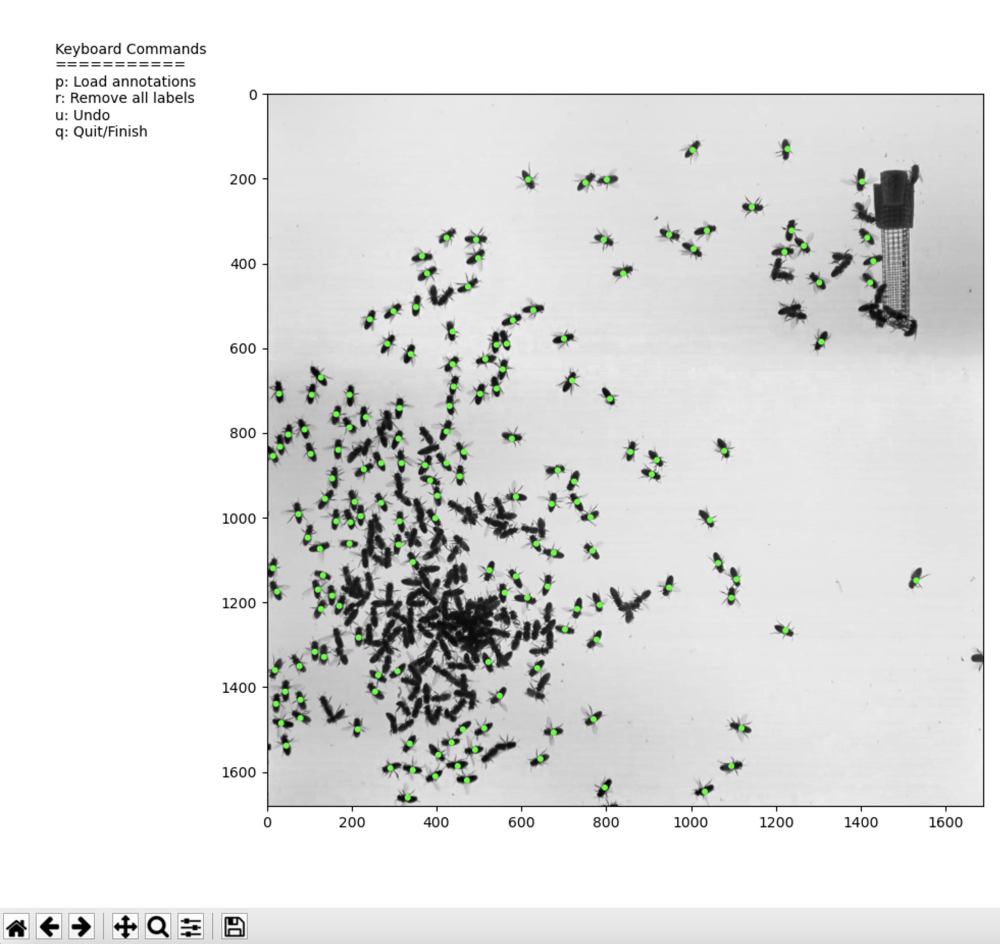
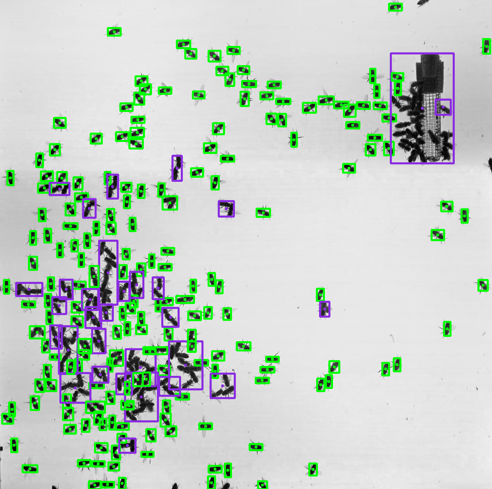
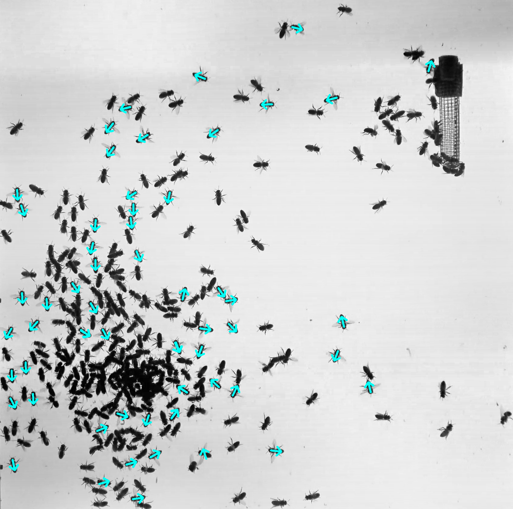

# Collective Olfactory Communication in Honey Bees
# Computer Vision Pipeline

## Overview:
This repo provides the code for the computer vision/deep learning pipeline used to analyze honey bee experimental data in [(Nguyen et al. 2020)](https://www.biorxiv.org/content/10.1101/2020.05.23.112540v1). The pipeline primarily includes dense object detection of individual bees in videos, classification of bees into scenting bees (wide wing angles as primary proxy for scenting), and estimation of the bees' body orientations.

## Main requirements (versions tested on):
- Python 3.8.3
- NumPy 1.17.4
- mH5py 2.10.0
- Matplotlib 3.1.1

The complete list of required packages provided in requirements.txt, which you can install in your environment with the command pip install -r requirements.txt. Setting up a Python virtual environment, such as [conda](https://docs.conda.io/projects/conda/en/latest/user-guide/tasks/manage-environments.html), is highly recommended.

<!-- ----------------------------------------------------------------------- -->

## Step 1. Detect bees

This is a semi-automatic process that uses Otsu’s adaptive thresholding, morphological transformations, and connected components to detect individual bees in the frames. Bees that are in clusters (i.e. touching or overlapping with one another) are detected as clusters of various sizes.

### Input:
Images of frames extracted from video. Images should be stored in *data/processed/{folder_name}/{frames_folder_name}/*. A small dataset is provided here, and should be unzipped and placed in *data/processed/*. Inside the dataset folder, *denoised_frames/* holds the images from a short video. There is also a folder *UI_annotation_history* that holds sample data for the annotation desribed below.

### Usage:
`python step_1__run_detection.py` takes in the (preprocessed) frame images from a chosen data folder and launches an interactive GUI with one frame (i.e. the first frame) and allows the user to click on centers of individual bees that are expected to be detected as individuals. Bees that touch or overlap one another should not be labeled and will be automatically detected as clusters. See example below for the GUI and bees that should be labeled (green dots). After the user finishes labeling this frame, the algorithm will use the labels to search for parameters that will maximize accuracy of the algorithm's predictions checked against the user-provided labels. The best parameters are then used to automatically process the rest of the frames to detect individual bees and bees in clusters.

**Command line parameters:**
- `-p` or `--data_root`: Path to the data folder (default: `data/processed`)
- `-r` or `--fps`: Frame per second for output movie (default: 25)
- `-l` or `--limit`: Limit of images to process (default: 0)
- `-v` or `--verbose`: FFMPEG Verbosity when visualizing (default: False)
- `-f` or `--force`: Force overwrite in data folder (default: True)
- `-c` or `--draw_clusters`: Draw cluster detections (default: True)
- `-t` or `--draw_trash`: Draw trash detections (default: False)
- `-u` or `--prevUI`: Use previous UI results (default: False)

Example GUI labeling:

### Output:
A folder called *UI_annotation_history* will be made in the data folder to store the annotation history for future uses. After the algorithm detects bees, *data_log.json* will be created and it stores information of all the detected bees: the x, y positions of the bounding box top left corner and the width and height of that box. For visualization, a folder *detection_frames* and movie *detection_movie.mp4* will be created to show the output detections.

Example output frame (green=individuals, purple=clusters):

<!-- ----------------------------------------------------------------------- -->

## Step 2. Classify scenting bees

After detections in step 1, the individual bees can then be classified into scenting and non-scenting bees. We trained a ResNet-18 model for this binary classification task, and provide the trained model you can download here.

### Input:
The trained model (.pt file) should be placed in *scenting_classification/saved_models*. Input data to be processed should be in *data/processed/{folder_name}*: the *data_log.json* and the frame images (e.g. *denoised_frames*).

### Usage:
`python step_2__run_scenting_classification.py` runs the detection data through the model to classify individual bees into scenting or non-scenting. Running on a GPU is highly recommended for speed.

**Command line parameters:**
- `-p` or `--data_root`: Path to the data folder (default: `data/processed`)
- `-m` or `--model_file`: Name of trained model (default: `ResnetScentingModel.pt`)
- `-b` or `--batch_size`: Batch size (default: `32`)
- `-c` or `--num_classes`: Number of classes (default: `2`)

### Output: In the data folder for this specific movie, *data_log_scenting.json* will be created from this step. This builds upon *data_log.json* and adds a 'classification' to each bee in each frame.

<!-- ----------------------------------------------------------------------- -->

## Step 3. Estimate orientations

We can also obtain the body orientation of the scenting bees to know their scenting directions. Another ResNet-18 model is trained for the regression task of estimating the orientation angle (head to tail) of bees. The trained model is provided here.

### Input:
The trained model (.pt file) should be placed in *orientation_estimation/saved_models*. Input data to be processed should be in *data/processed/{folder_name}*: the *data_log_scenting.json* and the frame images (e.g. *denoised_frames*).

### Usage:
`python step_3__run_orientation_estimator.py` runs the classification data through the model to estimate the body orientation angle of individual bees. Running on a GPU is highly recommended for speed.

### Output: In the data folder for this specific movie, *data_log_orientation.json* will be created from this step. This builds upon *data_log.json* and *data_log_orientation.json* and adds an 'orientation' angle to each bee in each frame.

<!-- ----------------------------------------------------------------------- -->

## Step 4. Visualize scenting recognition data

After the whole detection and scenting recognition pipeline, we can make a movie of the output data to visualize the scenting bees and their scenting directions.

### Input:
The *data_log_orientation.json* from step 3 and the frame images (e.g. *denoised_frames*).

### Usage:
`python step_4__visualize.py` plots orientation arrows on the scenting bees and outputs a movie of all the frames provided.

### Output: In the data folder for this specific movie, a folder *output_frames* will be created to store the annotated frames and the *output_movie.mp4* will be created to make a movie of all the annotated frames.

Example output frame (green=individuals, purple=clusters):

